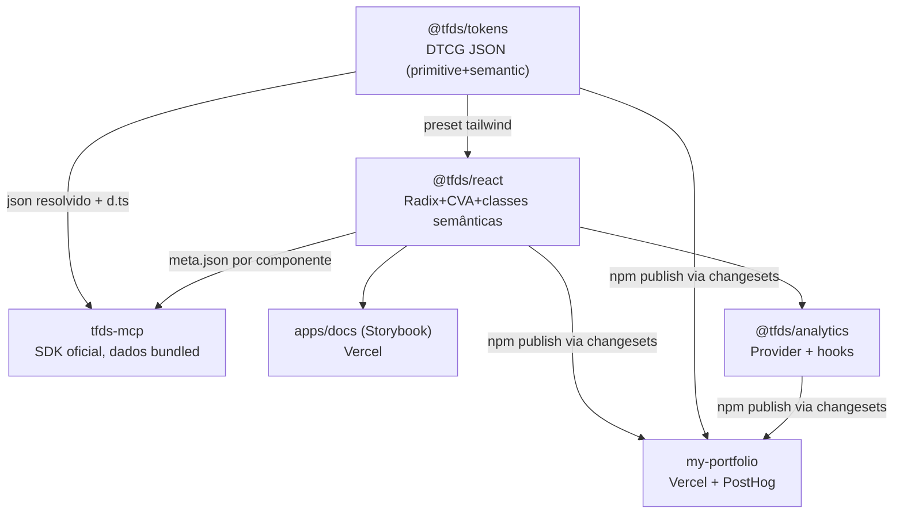

# tf.ds v2 Design

**Spec**: `.specs/features/tfds-v2/spec.md`
**Status**: Draft

---

## Architecture Overview

Monorepo existente (Turborepo + pnpm) evolui in-place. Fluxo de dados: tokens DTCG → build (Style Dictionary) → saídas css/js/tailwind/json+d.ts → consumidas por `@tfds/react` (classes semânticas) e pelo `tfds-mcp` (JSON resolvido). O `meta.json` de cada componente é a fonte única de registry para Storybook, MCP e agentes.



---

## Code Reuse Analysis

### Existing Components to Leverage

| Component                  | Location                                            | How to Use                                                                       |
| -------------------------- | --------------------------------------------------- | -------------------------------------------------------------------------------- |
| Pipeline de tokens         | `packages/tokens/build.js` + `src/**/*.tokens.json` | Estender (json resolvido, d.ts, validação); estrutura primitive/semantic mantida |
| 7 componentes              | `packages/components/src/components/*`              | Retrofit (stories+meta.json); padrão CVA/variants/`as` mantido                   |
| `stack-shared.variants.ts` | `packages/components/src`                           | Base do Grid (gap/align compartilhados)                                          |
| Padrão de teste            | `button/button.test.tsx`                            | Template para testes dos demais                                                  |
| Storybook                  | `apps/docs`                                         | Já configurado; adicionar theme switcher + stories                               |
| Release scaffold           | `.changeset/`, `.github/`, `vercel.json` raiz       | Completar (action de publish; publishConfig)                                     |
| Card do portfolio          | `my-portfolio/src/components/*` (molecules)         | Referência de API p/ Card do DS (não copiar dependências de Motion)              |

### Integration Points

| System                  | Integration Method                                                            |
| ----------------------- | ----------------------------------------------------------------------------- |
| Portfolio (Tailwind v4) | `@import "@tfds/tokens/css"` + `@source "../node_modules/@tfds/react"` no CSS |
| PostHog                 | Adapter `track(event)` de ~1 função passado ao `AnalyticsProvider` no layout  |
| npm                     | changesets/action com `NPM_TOKEN` (secrets); `publishConfig.access: public`   |
| Claude Code / IDEs      | `npx tfds-mcp` (stdio)                                                        |

---

## Components

### @tfds/tokens (estender)

- **Purpose**: tokens DTCG com saídas consumíveis por humano e máquina
- **Location**: `packages/tokens/`
- **Interfaces (novas)**: export `./json` (por tema, aliases resolvidos), `./types` (d.ts com union de nomes); build falha em DTCG inválido/alias quebrado
- **Reuses**: Style Dictionary v4, estrutura primitive/semantic existente

### meta.json (novo contrato)

```typescript
interface ComponentMeta {
  name: string // PascalCase, ex. "Button"
  componentName: string // snake_case p/ analytics, ex. "button"
  status: "experimental" | "stable" | "deprecated"
  description: string
  props: Array<{ name: string; type: string; default?: string; description: string }>
  variants: Record<string, string[]> // ex. { variant: ["primary", ...], size: [...] }
  tokensUsed: string[] // nomes semânticos, ex. "color.action.primary"
  examples: Array<{ title: string; code: string }>
  dos: string[]
  donts: string[]
  analytics: {
    analyticsDefault: "on" | "off" | "excluded"
    supportedEvents: Array<
      | "component_display"
      | "component_click"
      | "component_change"
      | "component_view"
      | "component_error"
    >
    piiRisk: "low" | "medium" | "high"
  }
}
```

Validado por JSON Schema em `docs/schemas/component-meta.schema.json` (gate de build/test).

### guardrails.json (novo)

- **Location**: `docs/guardrails.json`
- Regras `{ id, description, severity: critical|major|minor, matrix: { nativeTag → replacement }, exceptions, examples: { wrong, right } }`
- Consumido por: `@tfds/eslint-config` (enforcement) e `tfds-mcp` (`get_guardrails`)

### @tfds/react (rename de @tfds/components)

- 7 retrofits + `Grid` (props `cols` responsivo + `gap`; className permitido — AD-007) + `Card` (surface: bg/border/radius/padding; sem Motion — animação é do consumidor)

### @tfds/analytics (novo)

- **Interfaces**: `AnalyticsProvider({ adapter, screenName })`; `useAnalytics()` → `emit(event)`; `ParentComponentContext`; tipos `AnalyticsEvent`, `TrackAdapter = (e: AnalyticsEvent) => void`
- Componentes interativos do `@tfds/react` chamam `emit` conforme `analyticsDefault` do meta.json; prop `analyticsEnabled` sobrepõe; sem Provider → no-op; `track` com try/catch

### tfds-mcp (novo, fora do monorepo? NÃO — decisão: dentro, como `packages/mcp`, publicado como `tfds-mcp`)

- **Rationale**: build precisa dos meta.json/tokens no publish; dentro do monorepo o bundling é um copy step no build
- SDK `@modelcontextprotocol/sdk`, stdio; tools `list_components`, `get_component`, `search_tokens`, `get_guardrails`, `get_examples`; resources (meta.json, tokens); 1 prompt de setup; erro estruturado com sugestões

---

## Error Handling Strategy

| Error Scenario                       | Handling                                   | User Impact                               |
| ------------------------------------ | ------------------------------------------ | ----------------------------------------- |
| Token DTCG inválido / alias quebrado | Build falha com arquivo+token na mensagem  | Erro claro em dev/CI; nunca saída parcial |
| Adapter analytics lança              | try/catch no emit, silencioso              | UI nunca quebra                           |
| Sem AnalyticsProvider                | Context default no-op                      | Componentes funcionam normal              |
| MCP: componente inexistente          | Erro estruturado + nomes válidos sugeridos | Agente se auto-corrige                    |
| Consumidor sem `@source`             | Componentes sem estilo                     | Doc de instalação com passo explícito     |
| Publish de versão existente          | changesets exige bump                      | Fluxo bloqueia antes do registry          |

---

## Risks & Concerns

| Concern                                                                            | Location                                          | Impact                                         | Mitigation                                                                                                                    |
| ---------------------------------------------------------------------------------- | ------------------------------------------------- | ---------------------------------------------- | ----------------------------------------------------------------------------------------------------------------------------- |
| Contradição doc×código: CLAUDE.md proíbe `className`, todos os componentes aceitam | `packages/components/src/**/*.tsx` vs `CLAUDE.md` | Regra ambígua p/ agentes e lint                | AD-007: className só em layout (VStack/HStack/Grid); remover das assinaturas dos estilizados no retrofit; atualizar CLAUDE.md |
| Build do portfolio quebra com `NODE_ENV=development` global                        | `my-portfolio` (documentado no CLAUDE.md)         | Falso negativo no gate da migração             | Gates do portfolio sempre com `NODE_ENV=production` explícito                                                                 |
| `lint`/`type-check` dos tokens são stubs (`echo`)                                  | `packages/tokens/package.json`                    | Gate passa sem verificar nada                  | T4 troca stubs por validação real                                                                                             |
| Rename de pacote/tema quebra o portfolio local (`file:`) durante a execução        | portfolio `package.json`, `globals.css`           | Dev local do portfolio quebrado até a migração | Aceito: migração (Phase 6) reconcilia; não deployar entre fases                                                               |
| Storybook precisa render nos 3 temas p/ DoD                                        | `apps/docs`                                       | DoD não verificável sem switcher               | T19 adiciona theme switcher na toolbar                                                                                        |

---

## Tech Decisions (only non-obvious ones)

| Decision                 | Choice                                               | Rationale                                                                                            |
| ------------------------ | ---------------------------------------------------- | ---------------------------------------------------------------------------------------------------- |
| Onde vive o MCP          | `packages/mcp` no monorepo, publicado `tfds-mcp`     | Bundling dos meta.json/tokens vira copy step de build; um repo só                                    |
| Card sem Motion          | Animação fica no consumidor                          | DS server-safe; Motion exigiria 'use client' em tudo                                                 |
| d.ts de tokens           | Gerado no build.js (template simples)                | Style Dictionary v4 não emite union types nativamente; template de ~30 linhas evita dependência nova |
| eslint guardrails na v1? | Só a regra "no native tag" básica; resto sob demanda | Enxuto (AD-008); a matriz já fica em guardrails.json                                                 |

> AD-007 registrado em `.specs/STATE.md`.
